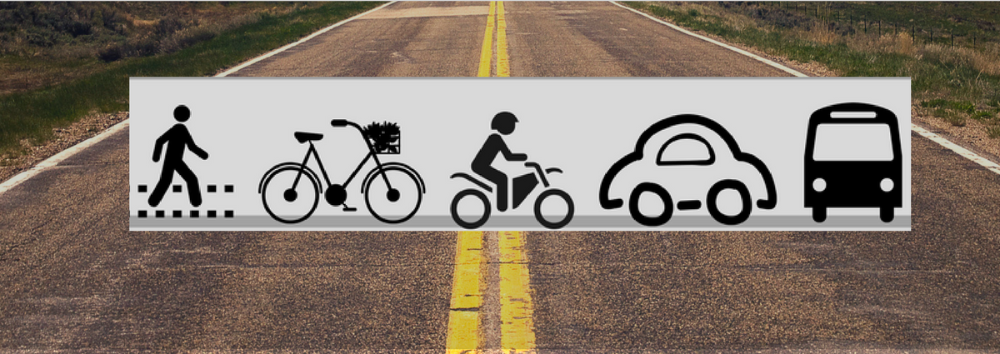
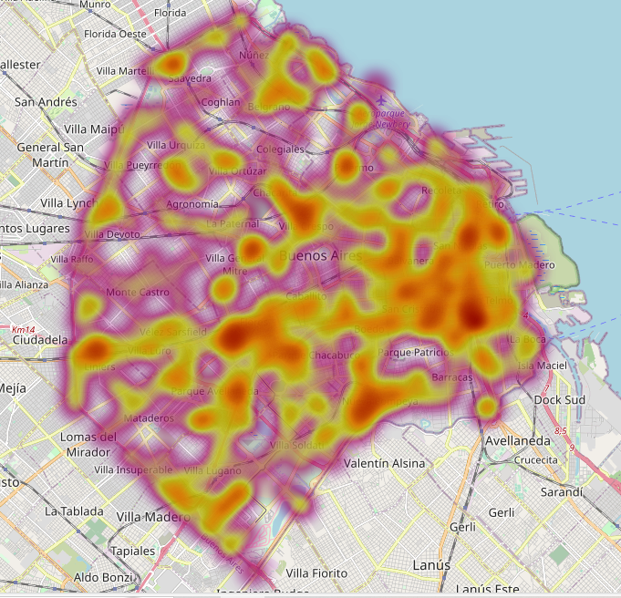

<h1 align="center"> PROYECTO INDIVIDUAL N° 2 </h1>

 
<h1 align="center"> Análisis de siniestros viales en la Ciudad Autónoma de Buenos Aires </h1>

## INTRODUCCIÓN AL PROYECTO

La ejecución de este proyecto se lleva a cabo desde la perspectiva de un analista de datos,en el cual me centro en analizar datos relativos a incidentes de tránsito en la Ciudad Autónoma de Buenos Aires, con el propósito de suministrar información que respalde la adopción de medidas destinadas a disminuir el número de siniestros viales. , en estrecha colaboración con el Observatorio de Movilidad y Seguridad Vial (OMSV) perteneciente a la Secretaría de Transporte del Gobierno de la Ciudad Autónoma de Buenos Aires, basándonos en una compilación de datos que abarca el período comprendido entre 2016 y 2021.

## _DESARROLLO:_

El análisis se enfoca en un conjunto de datos almacenados en archivo Excel: **homicidios.xlsx**, el cual abarca la información acerca de los siniestros viales en la Ciudad de Buenos Aires. Estos datos son sometidos a un proceso de Extracción, Transformación y Carga (ETL) con el fin de consolidar y depurar la información. Posteriormente, se lleva a cabo un análisis exploratorio de datos (EDA) para discernir las tendencias y patrones significativos.

_Pasos realizados:_

### 1.  ETL:
 Se procede con la etapa de Extracción, Transformación y Carga de los datos contenidos en el archivo **homicidios.xlsx**  A continuación, se lleva a cabo la integración de la información referente a víctimas  y hechos en un único DataFrame, facilitando así el análisis de ambos conjuntos de datos.

### 2.  EDA: 
Se procede a la normalización de los tipos de datos y a la depuración de inconsistencias presente en el conjunto de datos. Posteriormente, se lleva a cabo una primera etapa de visualización y análisis. 
Además se desarolló un  _Mapa de Calor_ en el cual dicho proceso de creación inicia con una filtración selectiva de los siniestros. Luego se procede a la obtención de las coordenadas (POS_X, POS_Y) asociadas a estos siniestros de gravedad. Estos puntos constituirán la base sobre la cual se construirá el mapa.
La visualización se potencia mediante la aplicación de un HeatMap, el cual superpone una representación gráfica de la densidad de siniestros. Esta representación emplea una escala de colores que va desde tonalidades de azul (indicando una baja densidad) hasta tonos de rojo (indicando una alta densidad).
Con todos estos elementos en su lugar, el mapa resultante es guardado como un archivo HTML bajo el nombre 'mapa_siniestros.html'. Este archivo contiene una representación visual y detallada de la distribución de siniestros  en el área de interés, proporcionando así una herramienta efectiva para el análisis y la toma de decisiones.

_Enlace_
[Mapa de siniestros interactivo](http://localhost:8000/mapa_siniestros.html)

### 3. Análisis de los KPIs propuestos, y el desarollo de un tercero: 

El primer KPI planteado tenia como objetivo disminuir en un 10% la tasa de víctimas fatales en accidentes de tránsito en comparación con el semestre anterior. Al examinar los resultados del último semestre del análisis(2021), se constata que esta meta se cumplió, dado que la tasa disminuyó significativamente, alcanzando una _reducción del 23.64%._  Se podria decir que se refleja cierto éxito en la implementación de medidas destinadas a mejorar la seguridad vial.

El segundo KPI planteado que buscaba reducir en un 7% la tasa de víctimas fatales en accidentes de tránsito de motociclistas con respecto al año anterior no alcanzó el objetivo, ya que al analizar los resultados del último año (2021), se evidencia que la tasa experimentó un _aumento del 76,92%._ En este caso, aunque no se cumple el objetivo nos propoc¿rciona información valiosa que ayuda a ajustar las estrategias de seguridad vial.

El tercer KPI, buscaba reducir en un 5% la cantidad de siniestros de peatones en el último año en comparación con el año anterior, el objetivo no se logró, aunque se redujo un 2.94% la tasa, no llegó a cumplir el objetivo planteado.

### 4.  Dashboard: 
Se procede a la creación de un dashboard interactivo que proporciona una visualización dinámica y accesible de los datos analizados. Además, se genera un informe detallado de análisis que ofrece insights y conclusiones clave derivados del estudio realizado.
El mismo se encuentra en la carpeta _Dashboard_ el repositorio de Github.

## RECOMENDACIONES:

_Con respecto a los motociclistas:_

La puesta en marcha de campañas de concientización enfocadas en la importancia del uso del casco. 
Asimismo, se sugiere la implementación de sanciones económicas considerables para aquellos que no acaten esta normativa de seguridad vial. La combinación de estas acciones se anticipa como una estrategia eficaz para mitigar la incidencia de accidentes y lesiones graves entre estos usuarios vulnerables de la vía pública.

 _Circularización en avenidas y calles de alto tránsito:_

Implementar campañas educativas que enfaticen la crucial importancia de obedecer las normas de tráfico. Esto incluye evitar el estacionamiento en doble fila, realizar cambios de carril de manera segura y respetar rigurosamente los límites de velocidad  semáforos en calles y avenidas.
Es necesario crear una conciencia sólida entre los conductores respecto a las maniobras peligrosas  y las consecuencias potencialmente fatales que pueden surgir de tales acciones. 

 

## _HERRAMIENTAS Y LENGUAJES UTILIZADOS:_
* Python
* Pandas 	
* Matplotlib
* Folium
* PowerBI
